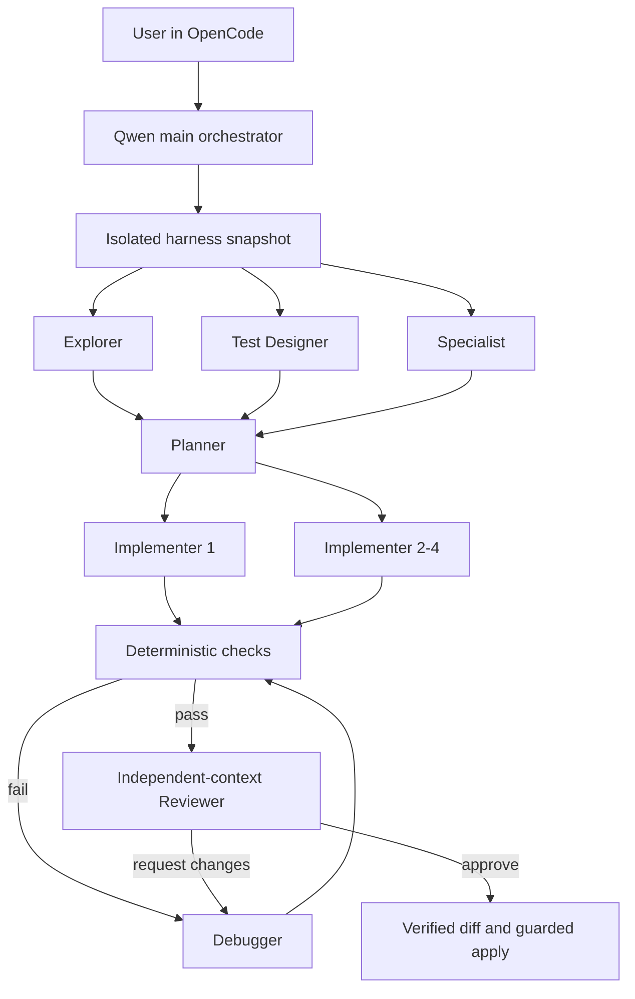

# Qwen Coding Harness

**A local, verifiable multi-agent coding harness for compounding the capability of approximately 100B open-weight models.**

[中文说明](docs/README.zh-CN.md) · [Architecture](docs/ARCHITECTURE.md) · [Model setup](docs/LLM_SETUP.md) · [Benchmark methodology](docs/BENCHMARKS.md) · [Roadmap](ROADMAP.md)

> Long-term goal: in bounded, tool-verifiable software tasks, combine a locally deployed open-weight model with an improving agent harness to approach closed frontier models from roughly one to three minor generations ahead.

This is the **initial alpha**, not a claim that the goal has already been reached. The project focuses on the part around the model: decomposition, context isolation, deterministic checks, repair loops, independent review, budgets, persistence, and safe application of changes.


## Initial evidence

On one fixed 100-task public coding set, the same local model moved from **51/100 one-shot public-test passes** to:

- **96/100** candidates passing the bundled public checks after agent workflows;
- **92/100** remaining after excluding four public-test passes for which later independent oracles found counterexamples;
- **41** tasks recovered beyond the one-shot baseline.

This is evidence that feedback loops can amplify a base model. It is **not** an official hidden-test score, not pass@1, and not proof of general repository-level parity with a frontier model. Independent oracle coverage currently includes 19 of the 41 recovered candidates; the other 22 have public checks but no independent oracle result yet. See [the complete methodology and limitations](docs/BENCHMARKS.md).


## What it does



- Runs all model calls through one shared concurrency gate, currently capped at four.
- Gives research roles isolated context and read-only tools.
- Splits implementation into up to four non-overlapping write scopes; overlapping plans are serialized.
- Runs configured tests, type checks, lint, or builds without asking the model to judge its own output.
- Re-enters a Debugger loop on failed checks or actionable review findings.
- Freezes a verified manifest before applying and refuses to overwrite user changes made after the snapshot.
- Stores checkpoints, events, diffs, test logs, token usage, and recovery state locally.

## Current scope

The current release is strongest on bounded Python projects and tasks with executable acceptance checks:

- reproducible bug fixes;
- small and medium feature work;
- module-level refactors;
- regression-test additions;
- build, type, and lint failures.

It is not yet a general autonomous software engineer. Large monorepos, browser workflows, databases, dependency installation, Git-history reasoning, file deletion/rename, and cross-service environments need more tooling. The Reviewer uses an independent context but the same base model, so correlated reasoning errors remain possible.

## Requirements

- Apple Silicon macOS for the current sandbox runner;
- Python 3.11 or newer;
- [OpenCode](https://opencode.ai/docs) installed or provided through `OPENCODE_BIN`;
- a local OpenAI-compatible chat-completions endpoint with tool calling;
- a local model directory containing `tokenizer.json` and `chat_template.jinja`;
- a Qwen-compatible chat template supporting `reasoning_effort` and tool calls.

The project was developed with [oMLX](https://github.com/jundot/omlx), but model weights are deliberately not included.

## Quick start

```bash
git clone https://github.com/SONGTAIKUN/qwen-coding-harness.git
cd qwen-coding-harness

python3.11 -m venv .venv
.venv/bin/python -m pip install --upgrade pip
.venv/bin/pip install -e '.[test]'

cp config.example.json config.json
# Edit model, model_directory, context limits, and endpoint in config.json.

# Official OpenCode tap on macOS:
brew install anomalyco/tap/opencode

# For an authenticated local endpoint:
export LOCAL_LLM_API_KEY='your-local-api-key'

./scripts/qwen-harness doctor
./scripts/qwen-code /absolute/path/to/your/project
```

Inside OpenCode, ask for a concrete implementation with acceptance criteria, for example:

```text
Add a multiply function with positive, negative, and zero tests. Use the harness,
inspect the verified diff, and apply it only after all configured checks pass.
```

The first launch creates `.agent-project.json` in the target project. Review its checks and permissions before allowing changes:

```json
{
  "checks": [
    {
      "name": "unit",
      "argv": ["{python}", "-m", "pytest", "-q"],
      "timeout_seconds": 120
    }
  ],
  "writable_paths": ["src", "tests"],
  "protected_paths": ["tests/frozen"],
  "read_roots": []
}
```

See [LLM setup](docs/LLM_SETUP.md) for oMLX and generic endpoint details.

## Direct harness commands

```bash
./scripts/qwen-harness init /path/to/project
./scripts/qwen-harness run "Implement the task and acceptance criteria" --root /path/to/project
./scripts/qwen-harness status RUN_ID
./scripts/qwen-harness wait RUN_ID
./scripts/qwen-harness diff RUN_ID
./scripts/qwen-harness apply RUN_ID
./scripts/qwen-harness cancel RUN_ID
./scripts/qwen-harness resume RUN_ID
```

`ready` means checks and review passed in the isolated copy. `applied` means the verified diff was written back. A `failed` or `needs_attention` run is not success.

## Safety model

- The Harness and model endpoint bind to loopback by default.
- Tests run through macOS `sandbox-exec` with network denied and writes limited to the copied workspace and a temporary directory.
- Secrets, model weights, virtual environments, Git metadata, and common build outputs are excluded from snapshots and version control.
- Models do not receive arbitrary shell access. Verification commands must be explicitly configured.
- This is not VM-grade isolation and does not impose a hard per-process memory ceiling. Use a VM for untrusted or adversarial code.

Read [SECURITY.md](SECURITY.md) before exposing any endpoint beyond localhost.

## Reproducing the visuals

The checked-in chart data is in `docs/benchmarks/summary.json`.

```bash
.venv/bin/pip install -e '.[docs]'
.venv/bin/python scripts/render_benchmark_assets.py
```

## Project status

This project is intended for sustained maintenance and empirical improvement. The next priorities are adaptive role routing, executable test-author isolation, repository indexing, budget control, and real-repository evaluations. See [ROADMAP.md](ROADMAP.md).

Contributions should include a reproducible failure, measurable improvement, or new deterministic check. See [CONTRIBUTING.md](CONTRIBUTING.md).

## License

Apache-2.0. See [LICENSE](LICENSE).
