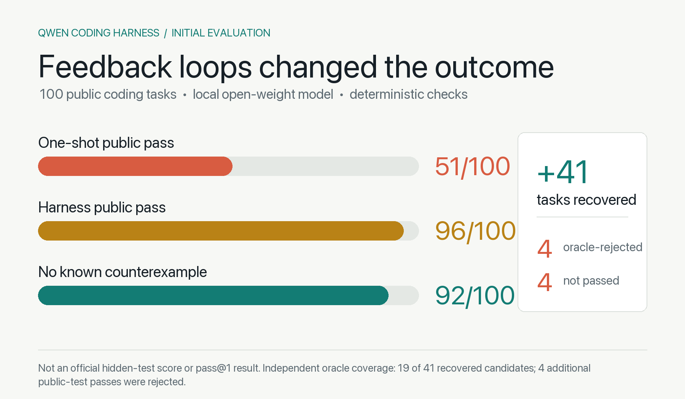
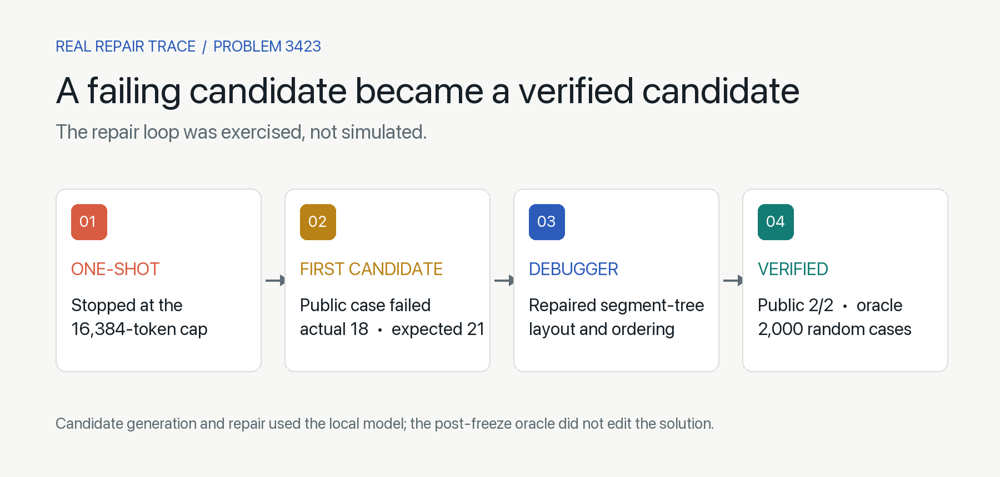

# Qwen Coding Harness

**一个面向约 100B 开源权重模型的、本地运行且可验证的多 Agent Coding Harness。**

[English](../README.md) · [架构](ARCHITECTURE.md) · [模型接入](LLM_SETUP.md) · [评测方法](BENCHMARKS.md) · [路线图](../ROADMAP.md)

> 长期目标：在边界清晰、能够通过工具验证的软件工程任务中，通过“本地部署开源模型 + 持续迭代的 Agent Harness”，尽可能逼近领先约一到三个小版本的闭源旗舰模型。

这只是项目的**第一个 Alpha 版本**，不是宣布目标已经实现。当前重点不是训练新模型，而是改进模型外围的工程系统：任务拆分、上下文隔离、确定性测试、反馈修复、独立审查、预算管理、状态持久化和安全回写。



## 当前证据

在同一组 100 道公开 Coding 任务上，同一个本地模型的结果为：

- 原始 one-shot 公开测试通过：**51/100**；
- Agent 工作流后公开测试通过：**96/100**；
- 排除 4 个后来被独立 oracle 找到反例的候选后：**92/100 暂无已知反例**；
- 相比 one-shot 补回：**41 题**。

这说明外部状态、角色分工、测试和修复循环能够明显放大基础模型能力，但它不是官方隐藏测试成绩，也不是 pass@1。41 个补回候选中，目前 19 个完成独立 oracle 验证，另 22 个只有公开测试证据。完整限制见[评测方法](BENCHMARKS.md)。



## 核心工作流

```text
OpenCode / 主 Agent
  → 隔离项目副本
  → Explorer / Test Designer / Specialist 并行研究
  → Planner 拆分 1–4 个无写入冲突的任务
  → Implementer 并行实现
  → 确定性测试、lint、类型检查和构建
  → Debugger 根据真实失败修复，最多三轮
  → 独立上下文 Reviewer 审查
  → 冻结候选、检查源文件冲突、再回写项目
```

所有主/子 Agent 共享最多四个模型请求槽，不会加载四份权重。测试不由模型自行判断，而是由沙箱中的确定性程序执行。

## 适用范围

当前版本最适合：

- 有复现步骤的 Bug；
- 小到中型功能开发；
- 模块级重构；
- 单元测试和边界测试补充；
- 构建、类型检查和 lint 修复。

目前尚未完整覆盖大型 monorepo、浏览器自动化、数据库、依赖安装、Git 历史分析、文件删除/重命名和跨服务环境。Reviewer 虽然使用独立上下文，但仍调用同一基础模型，因此可能出现相关性错误。

## 快速开始

```bash
git clone https://github.com/SONGTAIKUN/qwen-coding-harness.git
cd qwen-coding-harness

python3.11 -m venv .venv
.venv/bin/python -m pip install --upgrade pip
.venv/bin/pip install -e '.[test]'

cp config.example.json config.json
# 编辑 config.json，填写模型 alias、本地模型目录、上下文和 API 地址。

brew install anomalyco/tap/opencode
export LOCAL_LLM_API_KEY='你的本地 API key'

./scripts/qwen-harness doctor
./scripts/qwen-code /你的项目绝对路径
```

目标模型目录必须至少包含 `tokenizer.json` 和 `chat_template.jinja`。当前版本针对支持工具调用和 `reasoning_effort` 的 Qwen 聊天模板设计。oMLX 和其他兼容服务的配置方法见[模型接入](LLM_SETUP.md)。

首次进入项目会生成 `.agent-project.json`。必须先确认测试命令、允许写入路径和保护路径，然后再让 Agent 修改代码。

## 安全边界

- 默认只监听 `127.0.0.1`；
- 模型没有任意 shell 权限；
- 测试禁止联网，并限制文件读写范围；
- 模型权重、密钥、虚拟环境、Git 元数据和缓存不会提交到仓库；
- 回写前会校验冻结候选和源文件是否发生变化，并保存备份；
- 当前沙箱不是虚拟机级隔离，不应直接运行强对抗性未知代码。

## 长期维护方向

项目会围绕真实工程成功率而不是只针对算法题优化。近期重点包括自适应角色路由、独立可执行测试生成、仓库符号索引、动态预算、工具扩展和真实仓库评测。详见[路线图](../ROADMAP.md)。

本项目采用 Apache-2.0 许可证。
